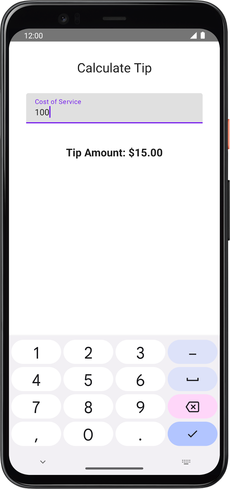

# Tip Calculator
This is practice exercise where we build Tip calculator with Jetpack Compose.
We will explore how to use and think about state when we use Compose. 
To do this, we build a tip calculator app called Tip Time with these built-in Compose UI elements:

* A TextField composable to enter and edit text.
* A Text composable to display text.
* A Spacer composable to display empty space between the UI elements.

